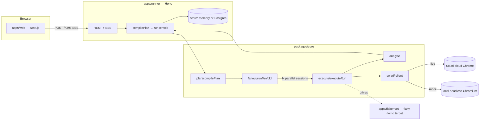

# Tenfold

**Your test passed. Run it ten times.**

Tenfold runs your plain-English test plan 10× in parallel in real cloud
Chrome and reports the **flake rate** — not pass/fail — with a **Solari
session replay attached to every failure**.

Every existing QA tool runs a test once and tells you pass or fail. A single
run says nothing about a race condition that only shows up 1 time in 5.
Tenfold's whole reason to exist is one sentence: stop asking "did it pass?"
and start asking "how often does it pass?"

|                          | Everyone else               | Tenfold                                |
| ------------------------ | ---------------------------- | --------------------------------------- |
| Runs once → pass/fail    | ✅                            | Runs 10× → **80% pass, fails at step 4** |
| Evidence on failure       | A screenshot, maybe          | **A session replay of every failure**   |
| Environment               | "Works on my machine"        | **Real Chrome, real network, 10 machines** |

Built on [Solari](https://getsolari.com): stealth cloud Chrome, per-session
recording, one API key.

## Try it

```bash
git clone <your fork>
cd solari-cookbook/examples/browser-flake-tenfold-ts
cp .env.example .env       # see "Running with zero API keys" below
pnpm install
pnpm dev:flakemart &        # deliberately flaky demo storefront, :3100
pnpm dev:runner &           # runner service, :8787
pnpm dev:web                # landing/run/report UI, :3000
```

Open http://localhost:3000, click **Run it 10 times**, watch 10 browsers
race through the plan, get a report that says `FLAKY — 8/10 passed, fails at
step 4, cause: ASSERTION_FAILED`.

### Running with zero API keys

Tenfold ships with a first-class **mock mode** so the entire pipeline —
compile → execute → fan out → analyze → report — runs and is demoable with
**no Solari account and no LLM key**:

- No `SOLARI_API_KEY` → sessions run on a real local headless Chromium
  instead of Solari's cloud (via `playwright-core`), with no cost and no
  session replay. Every Playwright action, timing number, and pass/fail
  result is still real; only cloud isolation, stealth, and recording are
  skipped.
- No `GROQ_API_KEY` (we use [Groq](https://console.groq.com/keys)'s free
  tier for the LLM backend, not Anthropic — see `.env.example`) → plan
  compilation and step verification fall back to a deterministic heuristic
  compiler (`packages/core/src/plan/localCompile.ts`) instead of an LLM
  call. It's tuned to read the Flakemart demo plan correctly and handles
  simple imperative English reasonably well in general.

Set either env var and that half of the pipeline upgrades transparently —
nothing else in the codebase changes. This is also why the CLI prints
`Solari mode: mock` or `Solari mode: live` on every run.

### CLI

```bash
pnpm tenfold run plan.txt --url https://example.com --n 10
```

`plan.txt` is one English step per line.

## Architecture



Nothing outside `packages/core/src/solari/` imports a Solari SDK type
directly — swapping the live implementation for a different provider, or
fixing an SDK signature mismatch, is a one-file change (`solari/live.ts`).

## Solari gotchas we hit

Confirmed against https://docs.getsolari.com on 2026-09-01 before writing
`solari/live.ts`:

1. **`await solari.close()` is mandatory.** The quickstart repo's own README
   says it plainly: skip it and the loopback proxy Solari opens locally
   keeps the Node process alive forever. `executeRun.ts` wraps every launch
   in `try/finally` so `release()` — which calls `solari.close()` — runs on
   every exit path: success, a failed step, a thrown error, or the hard
   deadline firing mid-step.
2. **Recording must be requested at launch, not after.** `recording: true`
   has to be part of the `client.launch()` call. We default it to `true`
   for every live session regardless of what the caller asked for — a
   replay you didn't need costs nothing extra to have; a replay you needed
   and didn't record is gone forever.
3. **Replay retrieval is asynchronous and undocumented in timing.** The docs
   confirm `getReplayUrl()`/`downloadReplay()` "execute asynchronously
   post-session" but don't specify a contract for how long that takes or
   whether early calls 404 or just return empty. We poll defensively —
   immediately, then every 1.5s up to `REPLAY_POLL_TIMEOUT_MS` (default
   30s) — and report `replayStatus: "pending"` rather than failing the run
   if it's still not back by then (`solari/live.ts`, `pollForReplay`).
4. **`429` (`ConcurrencyLimitExceeded`) is explicitly not retryable** — the
   docs are blunt about this: "no SDK retries it." A run that hits the
   Starter plan's 20-concurrent-browser ceiling needs to release sessions,
   not back off and retry. This is why `runs` is capped at 15 by default
   (`MAX_N`) — leaving headroom for the demo-target health check and a
   second concurrent visitor, per §1 of the build brief.
5. **`DELETE /sessions/:id` returns `404` for a release that failed, not
   `204`.** We never treat a `404` from cleanup as "already gone" without
   checking — see the fallback `releaseAndWait` attempt in `live.ts`'s
   `release()`.
6. **Exact page-acquisition and session-id property names are marked
   `[VERIFY]` in `solari/live.ts`.** The docs confirm `client.launch()`
   returns something Playwright/CDP-shaped with a `.close()`, but not the
   literal property name for the session id or the exact call to get a
   `Page` from it. We read `.sessionId ?? .id` and call `.newPage()`,
   matching the plain Playwright `Browser` interface the docs describe —
   this is the one thing in the codebase that needs a real key to confirm
   before a live deploy, and it's isolated to a single file by design.
7. **The sandbox this was built in required routing headless Chromium
   through an explicit outbound proxy** (`HTTPS_PROXY`) with `localhost`
   bypassed — Chromium doesn't inherit `HTTPS_PROXY` from the environment
   the way `curl` or Node's `fetch` do. Not a Solari-specific gotcha, but
   it's the reason `solari/local.ts` passes `proxy` explicitly rather than
   relying on ambient env vars. A normal deploy target (Render, Vercel)
   won't have this restriction.

## Honest limitations

- **`solari/live.ts` is unverified against a real key.** Everything in it is
  built directly from the documented SDK shape (confirmed via
  `docs.getsolari.com` and the `solari-cookbook` quickstart repo), with the
  two remaining ambiguities marked `[VERIFY]` in the file itself. If either
  is wrong, it's a one-file fix.
- **LLM backend is Groq, not Anthropic**, per this build's constraints —
  `packages/core/src/llm/groq.ts` is the only file that would need to
  change to swap providers again.
- **No self-hosted replay download yet** (P1 in the build brief) — a replay
  that expires after Solari's 7-day retention window is gone. The report
  shows `replaysExpireAt` so this is at least visible rather than a silent
  surprise.
- **No background replay-polling job separate from the run itself** — the
  brief's original design polls in a background sweep after the HTTP
  response returns; this build polls synchronously inside `release()`
  (bounded by `REPLAY_POLL_TIMEOUT_MS`) before the run is considered
  finished, trading a slightly longer tail latency for much simpler code.
  Revisiting this is a natural next step if replay upload times turn out to
  regularly exceed 30s in practice.
- **No profiles support yet** (P1) — the `options.profileId` field exists on
  `TestPlan` end-to-end but nothing populates it from the UI yet.
- **Flakemart's "hydration race" is a deliberately simplified model** of a
  real bug class (a client-side handler attaching after a delay), not a
  literal SSR/hydration bug — see `apps/flakemart/server.mjs` for the exact
  mechanism and why it was built that way.

## Repo layout

```
examples/browser-flake-tenfold-ts/
├── packages/core/        pure TS: plan compiler, executor, fan-out, analyzer, Solari wrapper
├── apps/runner/          Hono service: REST + SSE, owns the Solari key, budget guard, persistence
├── apps/web/             Next.js 14 app router: landing, live run view, report
├── apps/flakemart/       deliberately flaky demo storefront (plain Node, zero deps)
└── infra/                Postgres schema + deploy notes
```

## Definition of done

- [x] Hosted-demo-shaped: landing → run → report, no signup, works with zero
      API keys via mock mode.
- [x] Every browser session: recording requested, replay link wired into the
      report, `close()` guaranteed via `try/finally`.
- [x] Report shows pass rate, verdict, first-failure histogram, cause
      breakdown, own-misses row, per-run replays/screenshots, cost, p50/p95.
- [x] Flakemart reliably produces a FLAKY verdict; `?flake=0` produces
      STABLE.
- [x] Budget caps enforced (daily $ cap, per-IP run cap, N/step caps); BYOK
      works via `X-Solari-Key` and is never persisted.
- [ ] Public fork with README row added upstream (do this once the fork
      exists — see `infra/deploy.md`).
- [ ] Deployed to Vercel (web) + Render (runner + Flakemart + Postgres).
- [x] "Solari gotchas we hit" section (above), honest limitations (above).
