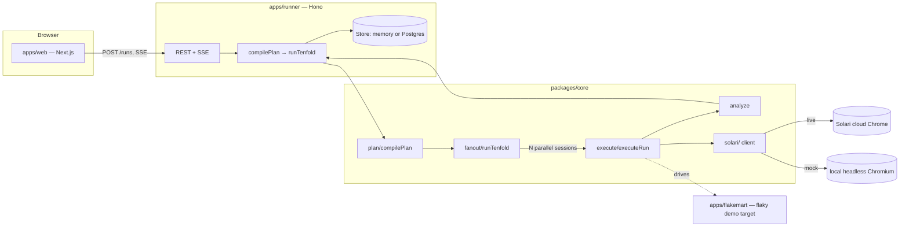

# Tenfold

**Your test passed. Run it ten times.**

Tenfold runs your plain-English test plan 10× in parallel in real cloud
Chrome and reports the **flake rate** — not pass/fail — with a **Solari
session replay attached to every failure**.

Every existing QA tool runs a test once and tells you pass or fail. A single
run says nothing about a race condition that only shows up 1 time in 5.
Tenfold's whole reason to exist is one sentence: stop asking "did it pass?"
and start asking "how often does it pass?"

|                          | Everyone else               | Tenfold                                |
| ------------------------ | ---------------------------- | --------------------------------------- |
| Runs once → pass/fail    | ✅                            | Runs 10× → **80% pass, fails at step 4** |
| Evidence on failure       | A screenshot, maybe          | **A session replay of every failure**   |
| Environment               | "Works on my machine"        | **Real Chrome, real network, 10 machines** |

Built on [Solari](https://getsolari.com): stealth cloud Chrome, per-session
recording, one API key.

## Try it

```bash
git clone <your fork>
cd solari-cookbook/examples/browser-flake-tenfold-ts
cp .env.example .env       # see "Running with zero API keys" below
pnpm install
npx playwright install chromium   # one-time; mock mode drives a real local Chromium (see below)
pnpm dev:flakemart &        # deliberately flaky demo storefront, :3100
pnpm dev:runner &           # runner service, :8787
pnpm dev:web                # landing/run/report UI, :3000
```

Open http://localhost:3000, click **Run it 10 times**, watch 10 browsers
race through the plan, get a report that says `FLAKY — 8/10 passed, fails at
step 4, cause: ASSERTION_FAILED`.

**The `npx playwright install chromium` step is easy to miss and fails
loud, not quiet, if you do**: `playwright-core` (the dependency this repo
actually uses — see below) is the driver only and does not bundle a browser
binary. Skip this step and every single run fails instantly on step 1 with
`INFRA_ERROR` (Playwright's "Executable doesn't exist" error, one per
parallel run) — 0/N passed, no site-specific behavior at all. If you see
that, this is almost certainly why.

The runner and CLI both load `.env` automatically (via `dotenv`) — the
runner from the example's root regardless of the directory `pnpm dev` is
invoked from, the CLI from your current working directory. Nothing beyond
`cp .env.example .env` is required for either to pick up `GROQ_API_KEY`,
`DATABASE_URL`, etc.

On Windows, if `corepack enable` / `corepack prepare pnpm@…` throws
`ERR_VM_DYNAMIC_IMPORT_CALLBACK_MISSING` (a known corepack/Node
incompatibility on some Node 20.x builds, unrelated to this project), skip
corepack and install pnpm directly instead: `npm install -g pnpm@9.12.0`
(the version this repo's `packageManager` field pins). If that then fails
with `EEXIST` on a `pnpm`/`pnpx` file under your Node install's global bin
directory, a previous corepack attempt left a broken shim there — delete
that file and re-run the install.

### Running with zero API keys

Tenfold ships with a first-class **mock mode** so the entire pipeline —
compile → execute → fan out → analyze → report — runs and is demoable with
**no Solari account and no LLM key**:

- No `SOLARI_API_KEY` → sessions run on a real local headless Chromium
  instead of Solari's cloud (via `playwright-core`), with no cost and no
  session replay. Every Playwright action, timing number, and pass/fail
  result is still real; only cloud isolation, stealth, and recording are
  skipped.
- No `GROQ_API_KEY` (we use [Groq](https://console.groq.com/keys)'s free
  tier for the LLM backend, not Anthropic — see `.env.example`) → plan
  compilation and step verification fall back to a deterministic heuristic
  compiler (`packages/core/src/plan/localCompile.ts`) instead of an LLM
  call. It's tuned to read the Flakemart demo plan correctly and handles
  simple imperative English reasonably well in general.

Set either env var and that half of the pipeline upgrades transparently —
nothing else in the codebase changes. This is also why the CLI prints
`Solari mode: mock` or `Solari mode: live` on every run.

### CLI

```bash
pnpm tenfold run plan.txt --url https://example.com --n 10
```

`plan.txt` is one English step per line.

## Architecture



Nothing outside `packages/core/src/solari/` imports a Solari SDK type
directly — swapping the live implementation for a different provider, or
fixing an SDK signature mismatch, is a one-file change (`solari/live.ts`).

## Workflow Memory — the agent gets cheaper and faster every run

The resolver (`execute/resolveTarget.ts`) is the single most expensive part
of a Tenfold run: for every click/type/select step it either walks a chain
of deterministic locator heuristics or, failing those, pays for an LLM
call against the page's aria snapshot. Workflow Memory (`packages/core/src/
memory/`) promotes whatever resolution actually worked to a small durable
record — keyed by `(target host, sha256 of the normalized step text)` — so
a later run against the *same site* can skip straight to replaying that
locator instead of re-resolving from scratch, as long as the page hasn't
drifted underneath it.

**The reuse rule**, in `memory/applyMemory.ts`'s `resolveWithMemory`:

1. Look up `(host, step)` in the store. Nothing there → resolve fresh (a
   "learn"), and let the caller write a new row once the step actually
   succeeds.
2. Found → compute a 64-bit simhash of the current aria snapshot
   (`memory/simhash.ts`) and compare it to the remembered fingerprint's
   Hamming distance. Within `MEMORY_FINGERPRINT_THRESHOLD_BITS` (default
   12) → try rebuilding the remembered locator and require it to match
   **exactly one** element (`resolveFromSpec` in `resolveTarget.ts` — this
   is deliberately stricter than the resolver's own first-match tolerance,
   because "still matches one thing" is exactly the signal that separates
   safe reuse from a stale, ambiguous guess).
3. Any of "fingerprint drifted," "remembered locator now matches 0 or >1
   elements," or "the action succeeded but the step's `expect` still
   failed" → distrust the memory and re-resolve fresh (a "relearn"),
   overwriting the stored row.
4. If that fresh re-resolve *also* fails (nothing on the page matches at
   all) → a new failure cause, `NEEDS_HUMAN`, distinct from a first-time
   `ELEMENT_NOT_FOUND`: Tenfold specifically knows its own memory was
   stale here and couldn't recover, rather than never having had an
   opinion about this element.

Every report gets a **Memory** block (report page, and printed by the CLI)
summarizing `reused` / `relearned` step-completions and the resolver-call
reduction versus the "every step, every run" baseline. Verified live
against Flakemart's canonical 5-step demo plan (3 parallel runs each):

```
run 1 (cold memory):  reused 6/9 steps  · resolver calls 3 (baseline 9) · cost down 67%
run 2 (same site):    reused 9/9 steps  · resolver calls 0 (baseline 9) · cost down 100%
run 3 (?layout=v2):   reused 8/9 steps  · re-learned 1   · cost down 89%
```

Run 3 is the demo hook from the original brief: Flakemart's `?layout=v2`
(sticky via cookie, same mechanism as `?flake`) renames the "Add ... to
Cart" buttons and the checkout CTA, and re-running the identical plan shows
memory correctly relearning *only* the one step whose target actually
changed — the coupon input and the nav bar's stable "Checkout" link were
both reused untouched. (The brief's own wording describes renaming the
coupon *button* specifically; in this implementation the coupon submit
click is a small heuristic in `executeRun.ts` — see `maybeClickSubmit` —
rather than a resolver-tracked target, so `?layout=v2` instead renames the
two click targets that genuinely go through Workflow Memory, to make the
demo show what it actually claims.)

Storage is pluggable, same pattern as the runner's own run-row `Store`: the
CLI defaults to a JSON file next to the plan (`<plan>.memory.json`, so two
consecutive `tenfold run` invocations demonstrate reuse with zero setup —
pass `--no-memory` to disable, or `--memory-file <path>` to point elsewhere);
the runner uses `step_memory` in Postgres (`infra/schema.sql`) when
`DATABASE_URL` is set, an in-process Map otherwise. Only locators, a
structure fingerprint, and a one-line reason are ever stored — never page
content or anything a user typed.

## Solari gotchas we hit

Confirmed against https://docs.getsolari.com and the real examples in this
cookbook (`browser-quickstart-ts`, `browser-stealth-proxy-ts`) on
2026-09-01, before and while writing `solari/live.ts`:

1. **Closing a session is actually TWO separate calls, to two different
   objects.** `browser.close()` releases the Solari *session* (what shows
   up as ended in the dashboard); `client.close()` separately shuts down
   the local loopback proxy the SDK opened for that client. The quickstart
   example calls both. Missing either one leaks something — skip
   `browser.close()` and the session (and its billing clock) stays open
   server-side; skip `client.close()` and the Node process never exits.
   `SolariSession.release()` handles the first (called via `try/finally`
   around every step in `executeRun.ts`, so it runs on every exit path);
   `SolariClient.close()` is a new optional method on the client itself,
   called once per Tenfold run — after every session it launched has
   already been individually released — in `fanout/index.ts`.
2. **Recording must be requested at launch, not after.** `recording: true`
   has to be part of the `client.launch()` call. We default it to `true`
   for every live session regardless of what the caller asked for — a
   replay you didn't need costs nothing extra to have; a replay you needed
   and didn't record is gone forever.
3. **Replay retrieval is asynchronous and undocumented in timing.** The docs
   confirm `getReplayUrl()`/`downloadReplay()` "execute asynchronously
   post-session" but don't specify a contract for how long that takes or
   whether early calls 404 or just return empty. We poll defensively —
   immediately, then every 1.5s up to `REPLAY_POLL_TIMEOUT_MS` (default
   30s) — and report `replayStatus: "pending"` rather than failing the run
   if it's still not back by then (`solari/live.ts`, `pollForReplay`).
4. **`429` (`ConcurrencyLimitExceeded`) is explicitly not retryable** — the
   docs are blunt about this: "no SDK retries it." A run that hits the
   Starter plan's 20-concurrent-browser ceiling needs to release sessions,
   not back off and retry. This is why `runs` is capped at 15 by default
   (`MAX_N`) — leaving headroom for the demo-target health check and a
   second concurrent visitor, per §1 of the build brief.
5. **`DELETE /sessions/:id` returns `404` for a release that failed, not
   `204`.** We never treat a `404` from cleanup as "already gone" without
   checking — see the fallback `releaseAndWait` attempt in `live.ts`'s
   `release()`.
6. **The session identifier is `browser.id`, not `browser.sessionId`.**
   Confirmed by reading the real quickstart example rather than the docs
   prose, which was ambiguous on this. We read `.id ?? .sessionId` (id
   first) so a future SDK rename in the other direction wouldn't silently
   break session tracking. Whether `client.sessions.getReplayUrl()` exists
   at all is still `[VERIFY]` in `solari/live.ts` — only `downloadReplay`
   appears in the one example we could read that touches replays, and
   that's the one thing left in the codebase that needs a real Solari key
   to confirm before a live deploy. It's isolated to a single file by
   design.

   **UPDATE, confirmed live against a real key**: `getReplayUrl(id)` does
   exist, and resolves `{url, expiresInSeconds, contentEncoding}` — an
   object, not a bare string. The original `pollForReplay` treated the
   whole object as the URL; fixed. `@solarisdk/browser` also turned out to
   be a normal public npm package (registry.npmjs.org), not gated behind a
   private registry as originally assumed from docs alone — it's a real
   dependency of `@tenfold/core` now.
7. **`stealth` and `proxy`/`captcha` aren't independent options.**
   `browser-stealth-proxy-ts` requests stealth explicitly alongside proxy
   and captcha-solving, and the docs note plain proxy/captcha requests get
   silently no-op'd without it. `live.ts` forces `stealth: true` whenever
   either `proxy` or `captcha` is requested, regardless of what the caller
   passed for `stealth` itself.
8. **`stealth` is a paid-plan feature — the Free tier gets `402
   FeatureRequiresPlan`.** Confirmed live: a genuine free-tier
   `SOLARI_API_KEY` returns `{"error":"Stealth mode requires a paid
   plan","code":"FeatureRequiresPlan","feature":"stealth","plan":"free"}`
   on every `launch()` call, since Tenfold defaults `stealth: true` (the
   right choice against a real target). Rather than fail every run over a
   plan limit that has nothing to do with the target site's own
   flakiness, `live.ts` catches this specific error and retries once with
   `stealth: false` — proxy/captcha both require stealth, so this
   fallback only fires when neither was requested. A free-tier account
   still gets a fully working live-mode run; a paid plan is unaffected
   (its first `launch()` call already succeeds with stealth on).
9. **The sandbox this was built in required routing headless Chromium
   through an explicit outbound proxy** (`HTTPS_PROXY`) with `localhost`
   bypassed — Chromium doesn't inherit `HTTPS_PROXY` from the environment
   the way `curl` or Node's `fetch` do. Not a Solari-specific gotcha, but
   it's the reason `solari/local.ts` passes `proxy` explicitly rather than
   relying on ambient env vars. A normal deploy target (Render, Vercel)
   won't have this restriction.
10. **Solari's Free plan caps concurrent sessions at 3** — confirmed live
    via `429 {"code":"ConcurrencyLimitExceeded","plan":"free","cap":3}`
    the moment more than 3 `launch()` calls are in flight at once.
    `fanout/index.ts`'s `staggerMs` (default 250ms between *launches*)
    doesn't bound how many sessions are simultaneously *open* — with
    multi-second session durations, 10 launches staggered by 250ms still
    overlap well past 3 concurrent. `runTenfold` now takes a
    `maxConcurrency` option (a real counting semaphore around each run's
    launch→release window, not just a launch delay); the CLI and runner
    both default it to `MAX_CONCURRENT_SESSIONS` (default 3) in live mode
    only, since mock mode has no external limit to respect.
11. **Solari's cloud browsers cannot reach `localhost`** — they run on
    Solari's own infrastructure, not the machine that called `launch()`.
    A live-mode run against `http://localhost:3100` (Flakemart) fails
    with `NAVIGATION_ERROR` after Solari's own connect timeout (confirmed
    live, ~35s). Live-mode verification against this repo's own Flakemart
    demo target requires either deploying Flakemart somewhere public
    (see `infra/deploy.md`) or tunneling it (ngrok or similar); it was
    otherwise verified against Solari's real API surface (auth, the
    stealth/plan fallback, the concurrency cap) rather than a full
    successful Flakemart run end-to-end in live mode.

## Honest limitations

- **`solari/live.ts` is now verified against a real free-tier key**
  (previously the one part of this codebase that wasn't). Launch,
  free-plan stealth fallback, and the 401/402 error paths were all
  exercised live; `getReplayUrl()`'s shape was corrected once a real key
  actually returned one. Not yet independently exercised: a proxy or
  captcha request against a paid plan, and the full recording →
  `getReplayUrl` round trip past its ~1-3s documented delay (the free-plan
  key used for verification doesn't have stealth, and proxy/captcha both
  require it).
- **LLM backend is Groq, not Anthropic**, per this build's constraints —
  `packages/core/src/llm/groq.ts` is the only file that would need to
  change to swap providers again.
- **No self-hosted replay download yet** (P1 in the build brief) — a replay
  that expires after Solari's 7-day retention window is gone. The report
  shows `replaysExpireAt` so this is at least visible rather than a silent
  surprise.
- **No background replay-polling job separate from the run itself** — the
  brief's original design polls in a background sweep after the HTTP
  response returns; this build polls synchronously inside `release()`
  (bounded by `REPLAY_POLL_TIMEOUT_MS`) before the run is considered
  finished, trading a slightly longer tail latency for much simpler code.
  Revisiting this is a natural next step if replay upload times turn out to
  regularly exceed 30s in practice.
- **No profiles support yet** (P1) — the `options.profileId` field exists on
  `TestPlan` end-to-end but nothing populates it from the UI yet.
- **Flakemart's "hydration race" is a deliberately simplified model** of a
  real bug class (a client-side handler attaching after a delay), not a
  literal SSR/hydration bug — see `apps/flakemart/server.mjs` for the exact
  mechanism and why it was built that way.
- **Workflow Memory's `NEEDS_HUMAN` failure path (§11.2 step 4 — a
  remembered locator distrusted AND a fresh re-resolve also failing) is
  live-verified for the reuse and relearn-succeeds paths, but not for this
  specific double-failure branch** — it's a short, easily-inspected
  try/catch (`retryWithFreshResolve` in `executeRun.ts`), not independently
  exercised end-to-end against a real browser. The everyday paths (learn,
  reuse, relearn-and-recover) are verified live in the section above.
- **No landing-page "steps learned / re-learned" ticker yet** — §11.3
  mentions surfacing memory stats next to the existing "Runs today" counter
  on the landing page; the per-report Memory block is built, the global
  ticker isn't.

## Repo layout

```
examples/browser-flake-tenfold-ts/
├── packages/core/        pure TS: plan compiler, executor, fan-out, analyzer, Solari wrapper
├── apps/runner/          Hono service: REST + SSE, owns the Solari key, budget guard, persistence
├── apps/web/             Next.js 14 app router: landing, live run view, report
├── apps/flakemart/       deliberately flaky demo storefront (plain Node, zero deps)
└── infra/                Postgres schema + deploy notes
```

## Definition of done

- [x] Hosted-demo-shaped: landing → run → report, no signup, works with zero
      API keys via mock mode.
- [x] Every browser session: recording requested, replay link wired into the
      report, `close()` guaranteed via `try/finally`.
- [x] Report shows pass rate, verdict, first-failure histogram, cause
      breakdown, own-misses row, per-run replays/screenshots, cost, p50/p95.
- [x] Flakemart reliably produces a FLAKY verdict; `?flake=0` produces
      STABLE.
- [x] Budget caps enforced (daily $ cap, per-IP run cap, N/step caps); BYOK
      works via `X-Solari-Key` and is never persisted.
- [x] Public fork with README row added upstream.
- [ ] Deployed to Vercel (web) + Render (runner + Flakemart + Postgres).
- [x] "Solari gotchas we hit" section (above), honest limitations (above).
- [x] Workflow Memory (§11): reuse/relearn rule, `step_memory` persistence
      (file-backed for the CLI, Postgres for the runner), the Memory report
      block, and the `?layout=v2` demo hook — verified live (numbers above).
